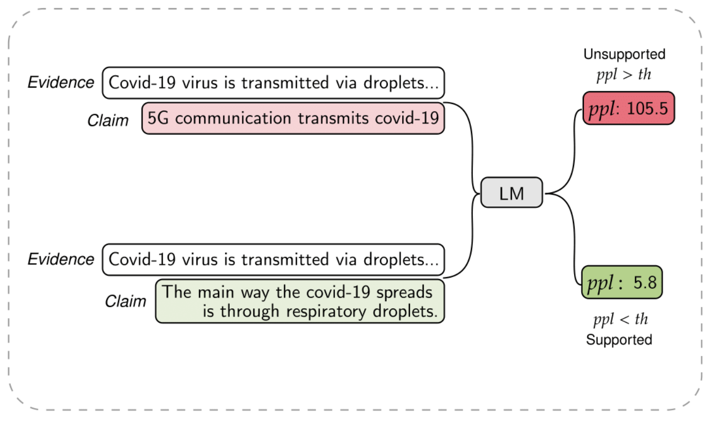

# Perplexity-FactChecking

 [](https://opensource.org/licenses/MIT) 

This respository contains the code for our paper:
**Towards Few-Shot Fact-Checking via Perplexity**. *Nayeon Lee\*, Yejin Bang\*,  [Andrea Madotto](https://andreamad8.github.io/)*, Madian Khabsa, Pascale Fung, *NAACL2021* [[PDF]](https://www.aclweb.org/anthology/2021.naacl-main.158.pdf)



## How to run

#### 1. Dataset Preparation

To download the testset with evidence, please fill in the request form - https://forms.gle/3TDnqv5Y8kFTN8Cu6
The details of test set can be found in the paper. 

After you download, please locate the data files under directory 'data/' 

#### 2. Obtain Evidence-conditioned Perplexity
By running the below script, files with perplexity scores will be saved in "/ppl_results" directory. 

**a. Causal Language Model**

```
    bash obtain_evidence_conditioned_perplexity_clm.sh
```

**b. Masked Language Model**

```
    bash mlm/obtain_evidence_conditioned_perplexity_mlm.sh 
```


#### 3. Hyper-parameter search (of the optimal threshold), and evaluate performance 

```
TODO code
```

## Citation:

If you find this paper and code useful, please cite our paper: 

```
@inproceedings{lee-etal-2021-towards,
    title = "Towards Few-shot Fact-Checking via Perplexity",
    author = "Lee, Nayeon  and
      Bang, Yejin  and
      Madotto, Andrea  and
      Fung, Pascale",
    booktitle = "Proceedings of the 2021 Conference of the North American Chapter of the Association for Computational Linguistics: Human Language Technologies",
    month = jun,
    year = "2021",
    address = "Online",
    publisher = "Association for Computational Linguistics",
    url = "https://www.aclweb.org/anthology/2021.naacl-main.158",
    pages = "1971--1981"
}
```

## Acknowledgement
This repository is implemented using [**Huggingface**](https://github.com/huggingface/transformers) codebase. 
For MLM, we utilize code from [**MLM-scoring Github**](https://github.com/awslabs/mlm-scoring)

